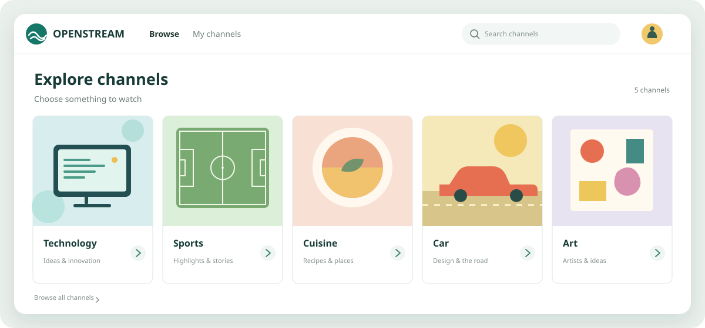
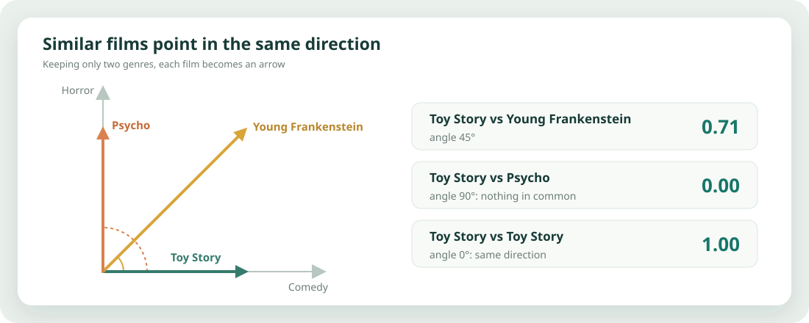
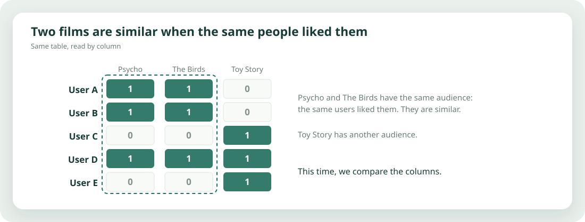
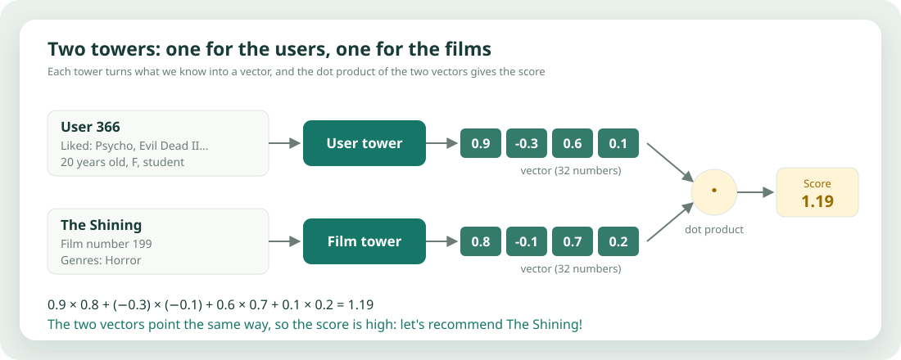
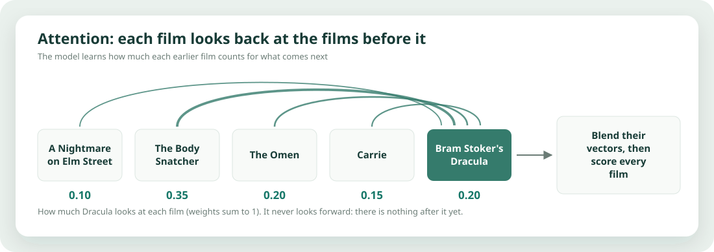
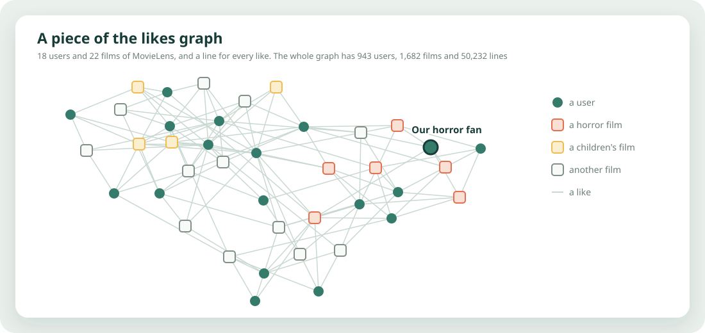
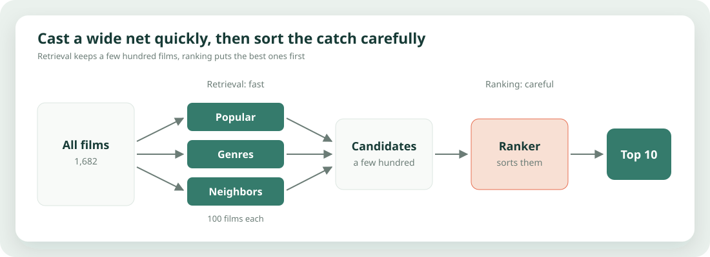

# Recommendation Systems

Recommendation systems are behind many of the things we use every day. This repo builds small Python simulations to understand how they work, one idea at a time. [📖 Read it online](https://felicienc.github.io/recommendation-systems/)

No black box and no magic: just data, intuition, and a bit of code 😄.

## The chapters

New to recommendation systems? Start with the [introduction](./src/recommendationsystems/introduction.md): what they are, how they work, and how recommendation differs from ranking.

Each chapter adds one new idea or tackles one new scaling challenge. We begin with the simplest setting, add richer sources of information, and finish with an architecture that serves recommendations in practice.

| | Chapter | What you learn |
|:-:|---|---|
|  | **01** [Contextual bandits](https://felicienc.github.io/recommendation-systems/01_bandits/01_bandits.html) | Cold start: recommend with no history, balancing **exploration** and **exploitation**. |
|  | **02** [Content-based](https://felicienc.github.io/recommendation-systems/02_content_based/02_content_based.html) | Recommend films that look like the ones you already like. |
|  | **03** [Collaborative filtering](https://felicienc.github.io/recommendation-systems/03_collaborative_filtering/03_collaborative_filtering.html) | Learn from collective behavior: people like you, films liked together. |
|  | **04** [Two towers](https://felicienc.github.io/recommendation-systems/04_two_towers/04_two_towers.html) | One vector per user, one per film: retrieval at scale, even for newcomers. |
|  | **05** [SASRec](https://felicienc.github.io/recommendation-systems/05_sasrec/05_sasrec.html) | Order matters: self-attention reads your history to guess what comes next. |
|  | **06** [LightGCN](https://felicienc.github.io/recommendation-systems/06_lightgcn/06_lightgcn.html) | Users and films as a graph: vectors that walk along the likes. |
|  | **07** [Retrieval and ranking](https://felicienc.github.io/recommendation-systems/07_retrieval_ranking/07_retrieval_ranking.html) | The production pipeline: cast a wide net, then sort the catch. |

## Run it locally

Install [uv](https://docs.astral.sh/uv/), run `make init`, then open any notebook with the `.venv` kernel (VS Code works out of the box).

## TODO: other techniques to cover

- **Bandits**: UCB and Thompson sampling.
- **Matrix factorization**: alternating least squares, and BPR for implicit feedback.
- **Factorization machines** and deep ranking models (Wide & Deep, DeepFM, DLRM).
- **Approximate nearest neighbor search** (HNSW, FAISS) to serve embeddings at scale.
- **Offline evaluation**: precision, recall, NDCG, and data leakage pitfalls.
- **Re-ranking**: diversity, novelty, and business rules.
- **Generative recommenders**: semantic IDs and LLM-based recommendations.
